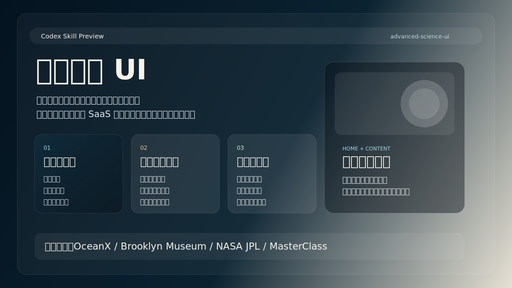

# Codex 高级科普 UI Skill

这是一个给 Codex 用的本地 skill，用来把“科普 / 教学 / 研究传播 / 展览式知识内容”做得更像数字展览、科学任务档案和纪录片页面，而不是传统网课平台或 SaaS 卡片站。

## 这个 skill 解决什么问题

默认情况下，模型很容易把“教育类 UI”写成这几种东西：

- 网课平台
- 卡片墙
- 模板化暗色科技风
- 只有首页好看、内容页很普通的两张皮

这个 skill 的目标就是纠正这种偏差，让 Codex 同时学会：

- 首页的电影海报感
- 内容页的编辑系统感
- 科学信息的可信度与秩序感

## 参考来源

这个 skill 的审美与结构规律来自对以下站点的首页与代表性内容页的拆解：

- [OceanX](https://oceanx.org/)
- [Brooklyn Museum](https://www.brooklynmuseum.org/)
- [NASA JPL](https://www.jpl.nasa.gov/)
- [MasterClass](https://www.masterclass.com/)

不是照抄视觉，而是提炼它们共同的系统能力：

- 首屏建立世界观
- 长文内容依然高级
- 图像、数据、术语、图注和 CTA 属于同一套语言

## 仓库结构

- `SKILL.md`
  - skill 主体，定义触发条件和执行规则
- `agents/openai.yaml`
  - UI 元数据与默认 prompt
- `PROMPT.md`
  - 一段可直接复用的中文高阶提示词
- `RELEASE_NOTES_CN.md`
  - 中文发布说明与设计来龙去脉
- `LICENSE`
  - 标准 MIT 开源许可证
- `LICENSE.zh-CN.md`
  - MIT 许可证中文说明版
- `assets/preview.svg`
  - skill 预览图
- `docs/ROADMAP.zh-CN.md`
  - skill 的 v1.5 / v2 演进路线图

## 预览图



## 安装方式

如果你希望 Codex 直接发现这个 skill，推荐把仓库克隆到本地 skills 目录：

```bash
git clone https://github.com/<your-account>/codex-advanced-science-ui.git ~/.codex/skills/advanced-science-ui
```

如果已经有本地目录，也可以直接覆盖或软链接。

如果你想先在本地试用，再决定是否覆盖现有 skill，可以这样：

```bash
git clone https://github.com/<your-account>/codex-advanced-science-ui.git ~/tmp/codex-advanced-science-ui
```

## 触发方式

你可以显式说：

```text
用 $advanced-science-ui 做这个页面
```

也可以在需求里直接写这些关键词，让它更容易自动触发：

- 科普 UI
- 教学网站
- 展览式内容页
- 科学叙事页面
- 数字图录
- 不要网课感
- 不要 SaaS 卡片墙

## 推荐搭配

如果任务是实际写前端页面，建议把这个 skill 和已有的前端实现能力一起用：

- `frontend-skill`
  - 负责整体前端高级感和落地实现
- `advanced-science-ui`
  - 负责把方向收紧到“高级科普 / 展览 / 教学叙事”

## 使用原则

这个 skill 最核心的判断标准不是“有没有做出一个漂亮 hero”，而是：

- 首页像不像一张海报
- 内容页像不像一套真正可读的知识系统
- 长内容会不会一滚到底就掉回普通模板

如果只有第一页惊艳、后面全是常规文章流，那就说明这个 skill 还没有真正生效。

## 开源说明

本仓库使用 MIT 协议发布：

- 法律效力版本：`LICENSE`
- 中文说明版本：`LICENSE.zh-CN.md`

## 发布记录

首个公开版本的整理说明见：

- `RELEASE_NOTES_CN.md`

## 路线图

这个 skill 不是一次性 prompt，而是会持续打磨的设计能力。当前已经把后续的 `v1.5 / v2` 升级计划整理成 roadmap：

- [docs/ROADMAP.zh-CN.md](/Users/chenyuanjie/developer/codex-advanced-science-ui/docs/ROADMAP.zh-CN.md)

这份 roadmap 主要回答 4 个问题：

- 新 benchmark 网站以后怎么被吸收
- 学习结果如何沉淀进经验库和 prompt
- 什么时候需要把新风格升级成 option
- v1.5 和 v2 的边界、目标和进入条件分别是什么
